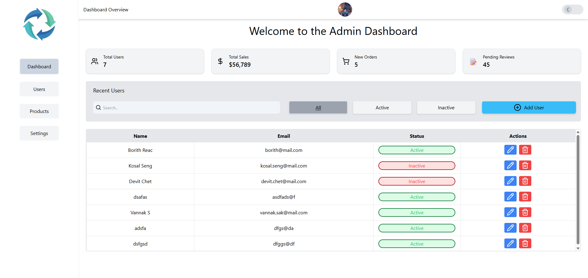
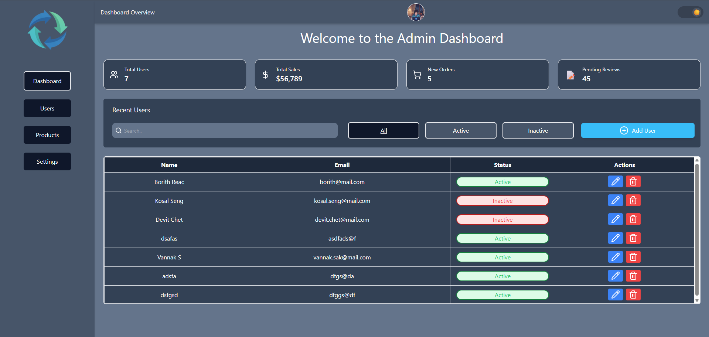
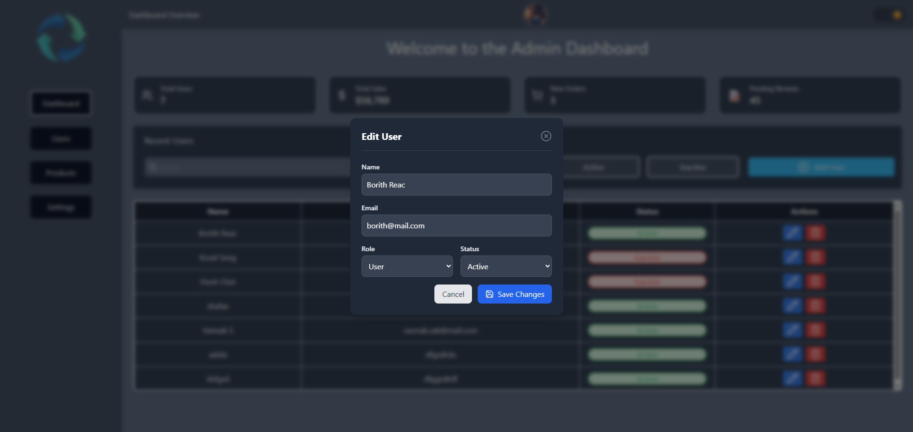

# 📊 Admin Dashboard UI (React + TailwindCSS)


A modern and responsive **Admin Dashboard UI** built with **React** and **Tailwind CSS**.  
This dashboard focuses on **user management, clean UI, and real-world usability**, making it ideal for small to medium web applications.

---

## 🚀 Live Demo

🔗 https://admin-dashboard-ui-five.vercel.app/

---

## ✨ Features

- 📋 User Management (Add / Edit / Delete)
- 🔍 Search users by name or email
- 🏷️ Filter users by status (All / Active / Inactive)
- 🌙 Dark Mode with LocalStorage persistence
- 💾 Data persistence using LocalStorage
- 📊 Dashboard statistics cards
- 🧩 Modular & reusable React components
- 📱 Fully responsive (Desktop & Mobile)

---

## 🛠️ Built With

- **React** (Hooks: useState, useEffect, useMemo)
- **Tailwind CSS**
- **Lucide React Icons**
- **JavaScript (ES6+)**
- **LocalStorage API**

---

## 📸 Screenshots





---

```txt
src/
├── assets/
│   ├── Logo.png
│   └── Profile.png
│
├── components/
│   ├── DarkModeToggle.jsx
│   ├── Sidebar.jsx
│   ├── Topbar.jsx
│   ├── StatCard.jsx
│   ├── Table.jsx
│   ├── FilterBar.jsx
│   ├── UserModal.jsx
│   └── EditUserModal.jsx
│
├── data/
│   └── users.js
│
├── pages/
│   └── Dashboard.jsx
│
├── App.jsx
└── main.jsx

```

---

## ⚙️ Installation & Setup

1. Clone the repository

```bash
git clone https://github.com/Saktra007/Admin_Dashboard_UI.git
```

2. Navigate to the project folder

```bash
cd Admin_Dashboard_UI

```

3. Install dependencies

```bash
npm install
```

4. Run the project locally

```bash
npm run dev
```
